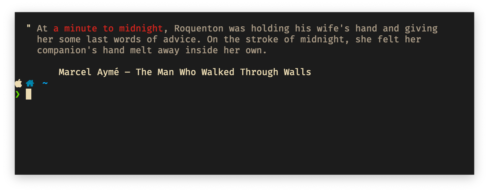

# Litime

A simple tool to display the current time with a quote from literature.

### Example

### Attributions
Built on top of the data from [JohannesNE/literature-clock](https://github.com/JohannesNE/literature-clock). See `script.py` for quick and dirty script to update.
