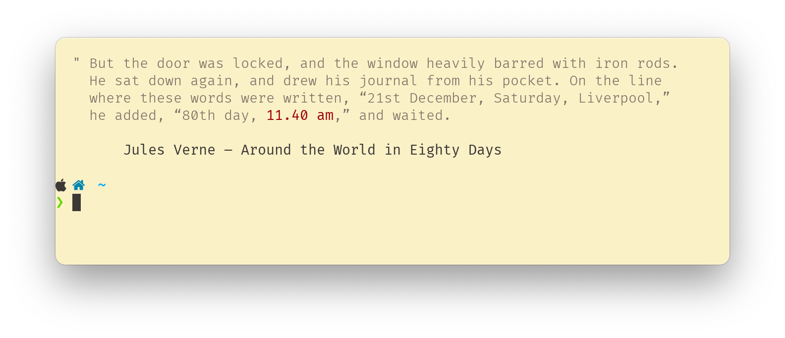
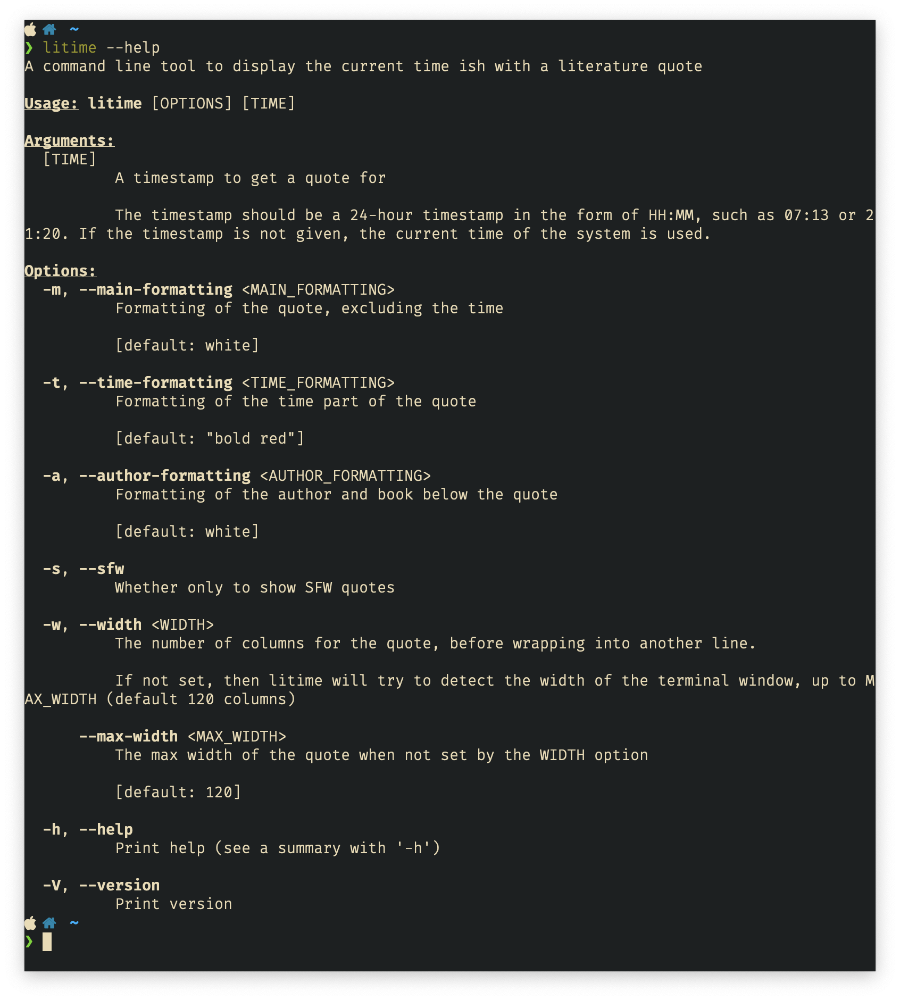

# Litime

A simple tool to display the current time with a quote from literature.

## Usage

_Running litime directly, which can be done on shell startup_

_Options_

## Install

Binaries are built with Github Actions and attached to releases for:
* Windows x86_64
* macOS x86_64
* Linux x86_64
* Linux armv7

You can also install directly with `cargo install litime` if you use cargo

## Attributions
### Source of quotes
Built on top of the data from
[JohannesNE/literature-clock](https://github.com/JohannesNE/literature-clock).
See `script.py` for quick and dirty script to update.
